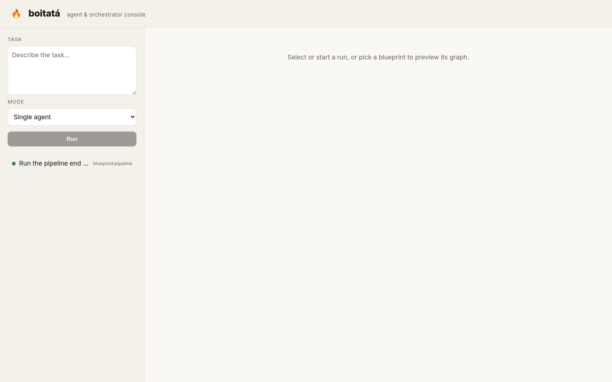
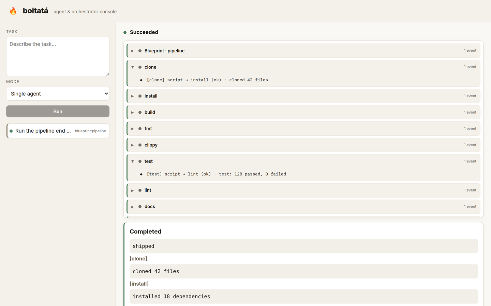
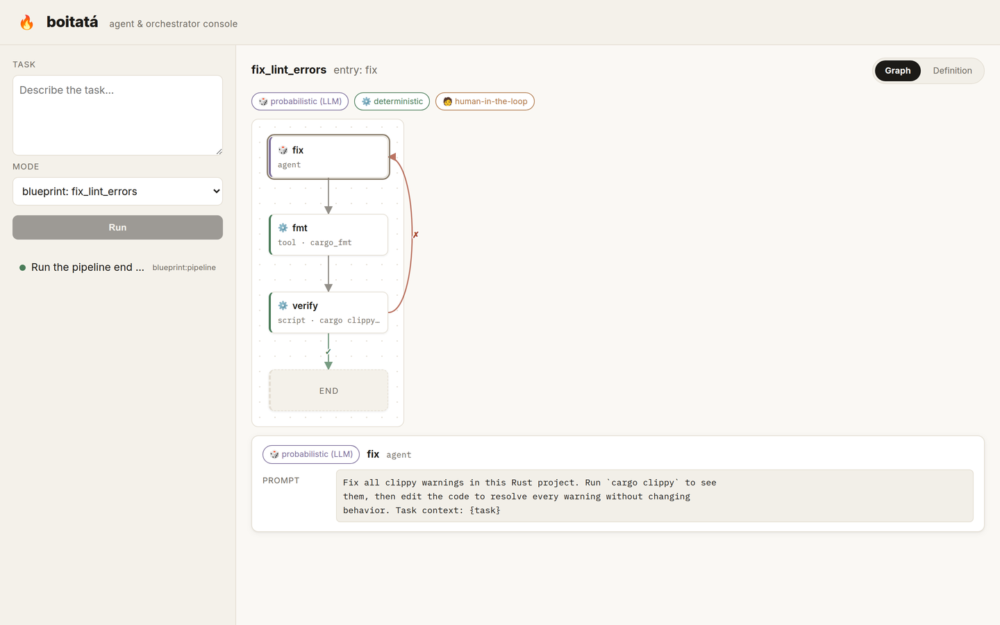

# Boitata

(to understand more the reasoning on the project read: https://www.elias.sh/posts/i-vibe-coded )

Boitata is a one-shot, end-to-end coding agent written in Rust. It is inspired
by Stripe's
[Minions](https://stripe.dev/blog/minions-stripes-one-shot-end-to-end-coding-agents-part-1)
and Block's [Goose](https://github.com/block/goose), and it runs tasks
unattended with little human input.

Give it a task in plain language. It plans, reads and edits files, runs
commands, and iterates against the compiler and test suite until the work is
done. Every run is fully auditable.

## Quick start

```bash
git clone https://github.com/cats-of-the-world/boitata.git
cd boitata
cargo build --release

cp boitata.example.toml boitata.toml   # then edit provider/model/base_url
export BOITATA_API_KEY="your-key"

./target/release/boitata run "Summarize the files in the current directory"
```

## Documentation

The full documentation is an [mdBook][book] published as a GitHub Pages site:
[read the book][pages].

You can also browse the sources in [`docs/src/`](./docs/src) or build it locally:

```bash
mdbook serve docs/      # live preview at http://localhost:3000
```

| Section | What you'll find |
|---------|------------------|
| [Getting Started](./docs/src/getting-started/installation.md) | Install, configure, run your first task |
| [Concepts](./docs/src/concepts/philosophy.md) | Determinism-first design and architecture |
| [Reference](./docs/src/reference/configuration.md) | Config, tools, security, blueprints, MCP, providers |
| [Interfaces](./docs/src/interfaces/server.md) | HTTP server and web UI |
| [Roadmap](./docs/src/project/roadmap.md) | What's done and what's next |

[book]: https://rust-lang.github.io/mdBook/
[pages]: https://cats-of-the-world.github.io/boitata/

## Highlights

- Unattended runs: a task goes in, a result comes out.
- Determinism first: leans on `cargo`, `rg`, and `git` instead of the LLM.
- Auditable: every run appends a structured JSONL event log.
- Blueprints: agent/tool/script/human graphs with retry and verify loops.
- Sandboxed execution: provision a container, clone the code, and run the agent
  inside it over the [Agent Client Protocol](https://agentclientprotocol.com/)
  (Firecracker microVMs next).
- MCP: connect any [Model Context Protocol](https://modelcontextprotocol.io)
  server.

## Screenshots







## License

MIT. See [LICENSE](./LICENSE).
